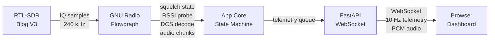
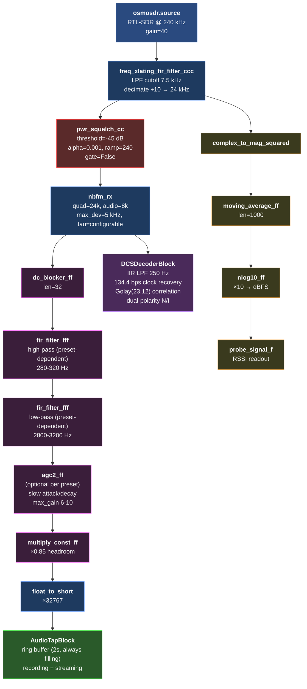
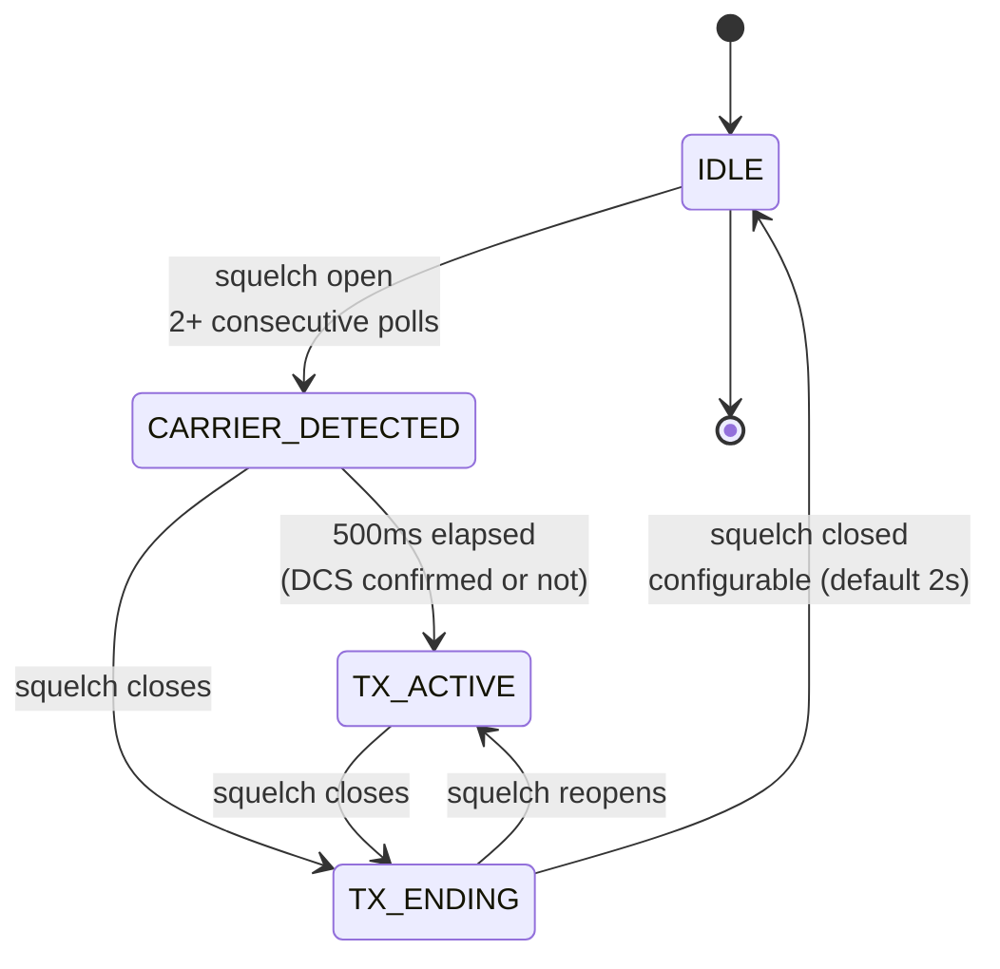
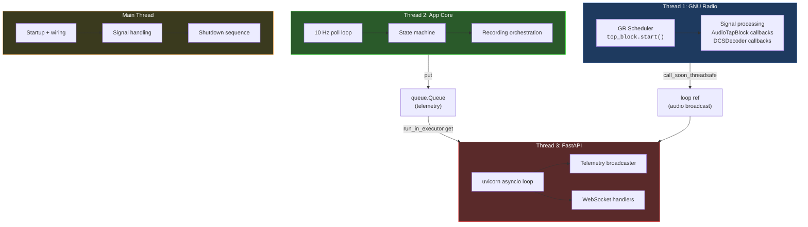

# SDR Monitor — Design Document

## Overview

Generic NFM SDR monitor using GNU Radio + FastAPI web dashboard. Channel name, frequency, and DCS code are configured via channel YAML configs in `~/.config/sdr-rx/channels/` with CLI overrides. The built-in default monitors FRS Channel 1 (462.5625 MHz, no DCS).

Key features:
- RF power squelch on raw IQ samples (not audio energy)
- DCS/DPL Golay(23,12) tone decoding with dual-polarity detection (configurable code)
- RSSI signal level (dBFS)
- Web dashboard with live telemetry, audio streaming, and recording management
- DCS match rate tracking and mismatch flagging

## Architecture



## GNU Radio Flowgraph



### Sample Rates

| Stage | Rate | Decimation |
|-------|------|------------|
| RTL-SDR capture | 240 kHz | — |
| Channel filter output | 24 kHz | ÷10 |
| NBFM audio output | 8 kHz | ÷3 |

### DSP Path Design Decisions

**Two branches from NBFM:** The demodulated audio splits into two independent paths immediately after `nbfm_rx`:
- **Branch A (DCS):** Raw demod → `DCSDecoderBlock`. Needs the 146.2 Hz sub-audible DCS tone intact for decoding.
- **Branch B (Voice):** Full processing chain → `AudioTapBlock`. Filters, levels, and cleans the audio for listening and recording.

This split is critical — filtering the DCS tone out before the decoder would break DCS detection. Both paths receive the same demodulated samples; only the voice path is processed.

**Voice processing chain order:**
1. **DC blocker** (`dc_blocker_ff(32)`) — Removes DC offset from NBFM demod. The demodulator can produce small baseline wander from imperfect carrier tracking. A short (32-sample) DC blocker removes this without affecting voice frequencies. Must come first to prevent DC bias from shifting the HPF/LPF operating point.
2. **High-pass filter** (FIR, preset-dependent cutoff 280-320 Hz) — Removes the DCS sub-audible tone at ~134 Hz and any sub-audio rumble. FIR chosen over IIR for linear phase (no group delay distortion on voice). Cutoff is above the DCS tone but below the voice first-formant region (~300-400 Hz).
3. **Low-pass filter** (FIR, preset-dependent cutoff 2800-3200 Hz) — Removes high-frequency hiss, squelch edge artifacts, and out-of-band noise. NFM voice intelligibility is preserved up to ~3 kHz; content above that is noise in this application.
4. **AGC** (`agc2_ff`, optional per preset) — Stabilizes loudness across weak and strong transmissions. Conservative preset uses slow decay (1e-3) and low max_gain (6.0) to minimize "pumping" artifacts on noisy channels. Aggressive preset allows faster decay (2e-3) and higher max_gain (10.0) for more leveling. The `flat` preset disables AGC entirely for raw monitoring.
5. **Headroom limiter** (`multiply_const_ff(0.85)`) — Scales output to 85% before `float_to_short` conversion. Prevents AGC overshoot from causing int16 clipping. The 15% headroom absorbs transient peaks that the AGC hasn't caught yet.
6. **Float to int16** (`float_to_short(1, 32767)`) — Final conversion for the AudioTapBlock.

**Why tau is configurable (default 0):** The NBFM demodulator's `tau` parameter controls FM de-emphasis — a high-frequency rolloff that compensates for pre-emphasis in broadcast FM. LMR systems typically do not use pre-emphasis, so `tau=0` is the default. However, some older LMR systems do apply mild pre-emphasis, and the difference is best judged by ear on actual recordings. The `--tau` CLI option allows A/B testing without code changes. Try `--tau 0` vs `--tau 75e-6` and compare recordings. Implementation note: GNU Radio's `nbfm_rx` does not accept `tau=0` or `tau=None` (divides by tau internally). When tau=0 is requested, the flowgraph substitutes `tau=1e-9`, which places the de-emphasis corner frequency at 1 GHz — effectively a flat filter (<0.01 dB variation across the audio band).

**Why voice filtering is in the flowgraph, not post-processing:** Previously, DCS tone removal was only applied by sox during WAV post-processing — live WebSocket audio was unfiltered. Moving the entire voice processing chain into the GNU Radio flowgraph ensures both live monitoring and recorded files receive identical filtering, AGC, and level management. Sox post-processing still runs on saved WAV files as a safety-net highpass and to convert mono to stereo for playback on both ears.

**Why the RSSI probe taps pre-squelch:** RSSI should reflect actual signal level regardless of whether the squelch gate is open. The probe chain (`complex_to_mag_squared → moving_average → nlog10`) connects to the channel filter output, not the squelch output. This allows the dashboard to show signal level rising toward the threshold before the squelch opens.

### Audio Presets

| Preset | HPF | LPF | AGC | Max Gain | Use Case |
|--------|-----|-----|-----|----------|----------|
| **conservative** (default) | 280 Hz | 3200 Hz | On, slow decay | 6.0 | General monitoring — minimal artifacts |
| **aggressive** | 320 Hz | 2800 Hz | On, faster decay | 10.0 | Noisy channels — tighter filtering, more leveling |
| **flat** | 250 Hz | 3400 Hz | Off | — | Raw monitoring — no AGC, wide passband |

Select via `--audio-preset conservative|aggressive|flat`.

### Squelch

`analog.pwr_squelch_cc` operates on IQ power, not demodulated audio. `gate=False` means it outputs zeros when squelched so all downstream blocks keep running. State is queried via `squelch.unmuted()` at 10 Hz from the app core.

### RSSI

Tapped pre-squelch from the channel filter output:

```
complex_to_mag_squared → moving_average(1000) → nlog10(10) → probe_signal_f
```

Reports dBFS (dB relative to full-scale).

### DCS Decoding

Custom `gr.sync_block` (`DCSDecoderBlock`) on the raw demodulated audio (float, 8 kHz, before HPF). The target DCS code is passed as a constructor parameter — codewords are computed at init time, not at module import.

1. Single-pole IIR LPF isolates sub-300 Hz DCS signal
2. Zero-crossing bit clock recovery at 134.4 bps (~59.5 samples/bit)
3. 23-bit shift register correlates against computed Golay codeword for the configured code
4. Checks both normal and inverted polarities on every shift
5. Requires 2 consecutive matches before declaring detected (non-matches reset counters)
6. Reports polarity per TX: `N`, `I`, or `unknown`

DCS codeword construction (example for code 565):
```
9-bit code (octal 565, reversed) + 3-bit fixed (100) → 12-bit data
12-bit data → Golay polynomial 0xAE3 → 11-bit parity
23-bit codeword = data | (parity << 12)
```

## State Machine



### State Details

| State | Entry Action | During | Exit |
|-------|-------------|--------|------|
| **IDLE** | — | Poll squelch + RSSI at 10 Hz | — |
| **CARRIER_DETECTED** | Reset DCS decoder, start recording (copy ring buffer as pre-trigger) | Wait up to 500ms for DCS | — |
| **TX_ACTIVE** | — | Record audio, track peak RSSI, check DCS (can retroactively confirm) | — |
| **TX_ENDING** | — | Count continuous squelch-closed polls | Finalize: save WAV, sox filter (HPF + mono→stereo), log CSV |

### Timing

- Poll rate: 10 Hz (100ms intervals)
- Carrier detection: 2 consecutive polls (200ms)
- DCS initial window: 500ms
- TX ending timeout: configurable via `--tx-tail` (default 2.0s, 20 polls)
- Pre-trigger buffer: 2 seconds (8 × 250ms chunks), always filling

### Gap Handling

The ring buffer fills continuously regardless of recording state. When a recording starts, the ring buffer contents are *copied* (not drained) as pre-trigger audio. This means:

- **Gaps < TX tail timeout:** Merged into one continuous recording (squelch reopens during TX_ENDING → back to TX_ACTIVE)
- **Gaps >= TX tail timeout:** Separate recordings, but the next TX always has a full 2-second pre-trigger from the ring buffer — no blind window during finalization

## Threading Model



### Cross-Thread Communication

- **Telemetry (T2 → T3):** `queue.Queue(maxsize=50)`. App core pushes dicts, FastAPI background task does blocking `queue.get()` via `run_in_executor`, then broadcasts to WebSocket clients. Sentinel `None` signals shutdown.
- **Live audio (T1 → T3):** `AudioTapBlock` callback invokes `broadcast_audio()` which uses `loop.call_soon_threadsafe()` to schedule async sends on the FastAPI event loop. Loop reference captured at FastAPI startup to avoid `get_event_loop()` errors from non-async threads. **Client gating:** `broadcast_audio()` checks `audio_client_count` (a simple int, thread-safe for reads via GIL) and returns immediately when zero — avoiding event loop scheduling, coroutine creation, and lock acquisition when nobody is listening. The count is maintained on WebSocket connect/disconnect and dead client cleanup.
- **Shutdown:** Main thread sets `shutdown_event`, app core stops (saves in-progress recording), sentinel pushed to queue, uvicorn `should_exit` set, flowgraph stopped. Second SIGINT forces `os._exit(1)`.

## Web Frontend

### Endpoints

| Method | Path | Description |
|--------|------|-------------|
| GET | `/` | Dashboard HTML |
| WS | `/ws` | Telemetry at 10 Hz (RSSI, squelch, DCS, state, TX count) |
| WS | `/audio/live` | Live PCM audio (4-byte seq + 8 kHz s16le mono chunks) |
| GET | `/api/transmissions` | JSON transmission log |
| DELETE | `/api/transmissions/{index}` | Delete a transmission entry and its WAV file |
| GET | `/api/channel` | Channel info (name, freq, DCS code, DCS mode) |
| GET | `/api/config` | Current squelch threshold + gain |
| PUT | `/api/config` | Update squelch/gain at runtime |
| GET | `/audio/<filename>` | Download recorded WAV file |

### Dashboard

Vanilla HTML/CSS/JS, no frameworks. Dark theme with CSS grid layout. Responsive design for mobile.

Components:
- Status bar with LED indicators (squelch, DCS, recording, connection)
- Signal level meter (color-coded bar with threshold marker)
- Numeric RSSI display (dBFS)
- Squelch threshold and gain sliders (live update via WebSocket)
- Live audio button (Web Audio API with jitter buffer)
- Transmission log table (scrollable, newest first, with play/download/delete per row)
- Log persistence: today's CSV is reloaded on startup

### Live Audio

Client-side architecture:
1. WebSocket receives binary frames: 4-byte big-endian sequence number + s16le PCM
2. PCM decoded to Float32Array, pushed to jitter buffer
3. `ScriptProcessorNode` drains buffer for playout
4. Prebuffer gate: waits for 600ms of buffered audio before starting playout
5. On buffer drain, re-enters prebuffer state (inserts silence, no hard stop)
6. Auto-reconnects WebSocket on disconnect without recreating AudioContext (prevents resource leaks)

## File Structure

```
sdr-rx/
├── main.py              # CLI entry point (click), YAML loading, thread coordination
├── gr_engine.py         # MonitorFlowgraph(gr.top_block)
├── dcs_decoder.py       # DCSDecoderBlock — configurable DCS Golay decoder
├── audio_tap.py         # AudioTapBlock — ring buffer + recording
├── app_core.py          # State machine, CSV logging
├── web_server.py        # FastAPI, WebSocket handlers, /api/channel endpoint
├── config.py            # Default constants, ResolvedPaths, path resolution, sanitize_name()
├── recording.py         # WAV writing, sox filter (HPF + mono→stereo), disk cleanup
├── requirements.txt     # Python dependencies (includes pyyaml)
├── DESIGN.md            # This file
├── examples/
│   └── channel_template.yaml  # Template for --init-channel
└── static/
    ├── index.html       # Dashboard page (dynamically populated)
    ├── app.js           # WebSocket client, Web Audio, channel config fetch
    └── style.css        # Dark theme, responsive
```

## CLI Options

```
--config             Path to channel YAML config file (no default)
--channel            Select channel by ID from ~/.config/sdr-rx/channels/
--data-dir           Override data directory
--list-channels      List available channel configs and exit
--init-channel       Create a channel config from template and exit
--freq               Override channel frequency in Hz
--dcs-code           Override DCS code (octal digits as decimal, e.g. 565)
--name               Override channel name
--gain, -g           RTL-SDR tuner gain in dB (default: 40)
--squelch, -s        RF power squelch threshold in dB (default: -45.0)
--record / --no-record, -r/-R   Record transmissions to WAV (default: on)
--max-audio-mb       Max audio folder size in MB (default: 500)
--port, -p           Web dashboard port (default: 8080)
--host               Web dashboard bind address (default: 0.0.0.0)
--tx-tail            Seconds of squelch-closed before ending TX (default: 2.0)
--audio-preset       Voice processing preset: conservative|aggressive|flat (default: conservative)
--tau                FM de-emphasis time constant in seconds (default: 0, i.e. none)
```

## Dependencies

**System packages** (pre-installed):
- GNU Radio 3.10.9, gr-osmosdr, librtlsdr
- sox (audio filtering)
- numpy

**Python (venv with `--system-site-packages`):**
- fastapi, uvicorn, websockets, click
